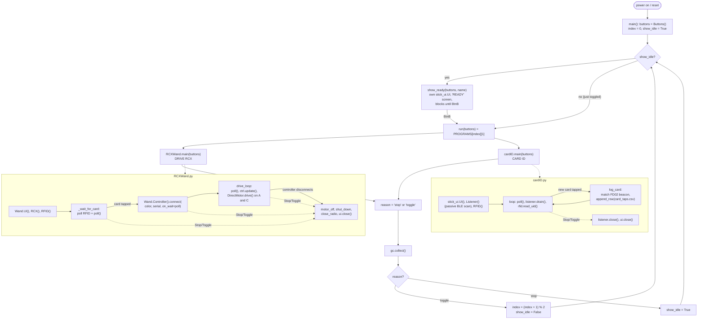

# RCX_Wand

Tap a LEGO Education connection card on an M5Stack StickS3 and pick,
by cycling with a button, from two things it can do: drive a real LEGO
Mindstorms **RCX**'s motors over IR from a Controller brick's
joysticks, or log which cards belong to which BLE broadcast.

Everything to do with RCX *firmware and programs* is driven from the
Mac instead, through two entry points at the top level:

| | |
|---|---|
| [`setup_wand.py`](setup_wand.py) | Set up a fresh StickS3: copy every library it needs, then check they import. |
| [`run_on_rcx.py`](run_on_rcx.py) | Compile a LASM program and run it on the RCX. |
| [`load_firmware_on_rcx.py`](load_firmware_on_rcx.py) | Flash RCX firmware, then load its five default programs. |

Both need the Stick plugged in over USB: the Mac compiles, the Stick
transmits. LASM can't be compiled on the device — `lasm_compiler.py`
needs `dataclasses`, `pathlib` and a 100KB `OpCodes.json`.

## Layout

| Path | What it is |
|---|---|
| [`main.py`](main.py) | The menu. Installed as `main.py` on the board so it runs on boot — see the flow chart below. |
| [`RCXWand.py`](RCXWand.py) | **DRIVE RCX** — tap a card, find the Controller tapped with it over BLE, drive RCX motors A/C in direct mode. |
| [`cardID.py`](cardID.py) | **CARD ID** — tap cards, log each one's RFID UID against its BLE (FD02) broadcast to `card_taps.csv`. |
| [`stick_menu.py`](stick_menu.py) | Shared `Stop`/`Toggle` exceptions + button-edge watcher both programs use to hand control back to the menu. |
| [`m5/`](m5/) | Minimal copy of the M5StickS3 MicroPython hardware library (power, RFID, display, audio, buttons, raw IR, the LEGO BLE "wand" protocol). Sourced from `micropython/M5StickS3/m5/`. |
| [`stick_ui.py`](stick_ui.py), [`lego_card.py`](lego_card.py) | Screen/speaker wrapper and card-decode helpers shared by `cardID.py`. |
| [`tools/rcx_ir.py`](tools/rcx_ir.py) | RCX-over-IR driver used by `RCXWand.py`. Ported from `micropython/M5StickS3/rcx_ir.py`'s framing/encoding, with direct-mode motor control added and corrected (see below). |
| [`tools/rcx_driver.py`](tools/rcx_driver.py) | RCX-over-IR driver used by both top-level entry points — a separate port from `ESP32-RCX/library/rcx_driver.py`, kept because it implements the acked firmware/program-download block-transfer protocol `rcx_ir.py` doesn't. Pushed to the device automatically. |
| [`examples/`](examples/) | Five runnable `.py` programs, each carrying its own LASM source — see [`examples/README.md`](examples/README.md). |
| [`tools/lasm_compiler.py`](tools/lasm_compiler.py) | Host-side LASM (LEGO Assembler) → RCX-bytecode compiler. Needs plain CPython (`dataclasses`, `pathlib`) — doesn't run on the Stick. `python3 tools/lasm_compiler.py` re-runs its self-test. |
| [`tools/stick_link.py`](tools/stick_link.py) | The Mac↔Stick plumbing (find the port, copy files, run a snippet) both entry points share. |
| [`tools/flash_rcx.py`](tools/flash_rcx.py) | Device-side flasher with the big on-screen progress readout. Pushed and invoked by `load_firmware_on_rcx.py`; not run by hand. |
| [`tools/rcx_firmware_data.py`](tools/rcx_firmware_data.py) | A real RCX firmware image (23,904 bytes), baked in by `ESP32-RCX/tools/srec_to_micropython.py` from a LEGO/ROBOLAB `FIRMWARE.TXT`. |
| [`tools/default_codes.lasm`](tools/default_codes.lasm) | The five default programs (slots 0–4) every freshly flashed RCX gets loaded with, straight after the firmware. |
| [`tools/lasm-opcode-reference.md`](tools/lasm-opcode-reference.md), [`tools/OpCodes.json`](tools/OpCodes.json) | The RCX/LASM opcode reference used to get motor control and the compiler right. |
| [`CLAUDE.md`](CLAUDE.md) | How the IR link and the compiler's encoding were actually verified — including five real bugs that took a working firmware download to find. Kept at the root so it loads as project context. |
| `venv/`, `requirements.txt` | Host-side Python env with the `legoeducation` PyPI package — a reference for the LEGO Education BLE protocol's App color codes (`PURPLE = 6`, etc.), the same numbering `m5/m5_wand.py` uses. Not imported by the on-device code. |

## `main.py`'s flow



Dashed arrows are the `stick_menu.Stop`/`Toggle` exception path — every
program polls buttons on its own schedule (once per RFID poll, once
per drive-loop tick, …) and raises one of these to hand control back
to `main.py`, which is what turns "BtnA pressed inside `RCXWand.py`'s
drive loop" into "back at the READY screen."

## Why `tools/rcx_ir.py` isn't a straight copy

Neither `micropython/M5StickS3/rcx_ir.py` nor the sibling `ESP32-RCX`
project's `library/rcx_driver.py` correctly drives motor direction:

- **`ESP32-RCX/library/rcx_driver.py`**'s `motor_on(motor_id,
  direction=1)` sends opcode `0x21` with flag `0x40` for reverse — but
  `0x21` ("OnOffFloat") only ever encodes float/off/on in its top two
  bits. It has no direction bit. Sending `0x40` there just turns the
  motor **off**, not reverse.
- **`micropython/M5StickS3/rcx_ir.py`** doesn't implement motor
  on/off/direction at all — only `set_power` at the opcode level
  (unused), ping, tone and battery.

Direction is a genuinely separate direct command, opcode `0xE1`
(`SetFwdSetRwdRewDir`), confirmed against LEGO's own P-Brick
Communication Protocol table (`tools/lasm-opcode-reference.md`, §3). Opcode
`0x13` (`SetPower`) also turned out to take a motor **bitmask**
(`0x01`/`0x02`/`0x04`) plus a power-source byte, not the plain `0/1/2`
index both existing repos use. `tools/rcx_ir.py` here implements all three
opcodes (`0x21` on/off/float, `0xE1` direction, `0x13` power) against
the verified table.

**Confirmed live on hardware**: motor A and motor C both run and
reverse correctly with `tools/rcx_ir.py`'s direction constants as currently
set. A **full firmware download has completed end to end** — all 120
blocks acked with status 0, and the RCX answered `UnlockFirmware` with
LEGO's easter-egg string, which its ROM only sends once valid firmware
is aboard. Downloading LASM programs uses the same acked block-transfer
mechanism but has not yet had a clean run against a real RCX.

Reply *decoding* is real but variable — see CLAUDE.md's "What is still
marginal". Transmit is reliable; it's the RCX → Stick direction that
drops packets.

## Running it

1. Flash the StickS3 with MicroPython — the **Octal-SPIRAM** build from
   [micropython.org](https://micropython.org/download/ESP32_GENERIC_S3/)
   (not the plain/quad build; this board has octal PSRAM).

   A board fresh from M5Stack ships with UIFlow, and getting it into
   download mode is the fiddly part. **Hold the power button down while
   plugging in the USB cable** — that is what actually works, confirmed
   on hardware. (M5Stack's own docs describe holding the side button
   for ~2s and releasing on a green LED blink; that did not work here.)
   Without it, esptool resets the chip, the native-USB serial port
   disappears mid-handshake, and you get `Device not configured` or
   `No serial data received`.

   Verify you are in download mode with a read-only probe first — it
   should name the chip rather than time out:
   ```
   esptool.py --chip esp32s3 --port /dev/cu.usbmodemXXXX \
       --before no_reset --after no_reset flash_id
   ```
   Then flash, keeping `no_reset` on both ends so esptool does not knock
   the board back out of the bootloader:
   ```
   esptool.py --chip esp32s3 --port /dev/cu.usbmodemXXXX \
       --before no_reset --after no_reset \
       write_flash --erase-all -z 0 ESP32_GENERIC_S3-SPIRAM_OCT-<ver>.bin
   ```
   It finishes with `Hash of data verified.` / `Staying in bootloader.`
   — unplug, replug, and press the power button to boot MicroPython.
2. Copy the device-side files onto the board:
   ```
   python3 setup_wand.py
   ```
   It copies `m5/` plus the wand programs and both drivers, then
   imports each one on the device and prints `WAND READY`. Use
   `--list` to see exactly what it would copy without doing it.

   Note the two drivers live in `tools/` but land at the device's
   root — its filesystem is flat, so repo layout and device layout are
   unrelated. `tools/stick_link.py`'s `WAND_FILES` is the canonical
   list; add new device files there, not to a copy command.
   `run_on_rcx.py` and `load_firmware_on_rcx.py` push whatever else
   they need (the driver, the firmware image, the flasher) themselves,
   so there is nothing to keep in sync by hand.
3. Wire up the Grove RFID2 Unit (for the connection card) — the StickS3's
   built-in IR LED/receiver need no extra wiring.
4. Point the StickS3 at the RCX's IR window, a few inches away.
5. Power on/reset. `main.py` boots straight into the **READY** screen
   for whichever program is first. **BtnB** starts it (or, once
   something is running, stops it and starts the *next* one
   immediately — see the flow chart). **BtnA** always stops back to
   the READY screen.
   - **DRIVE RCX**: tap a card, then tap the same card on a powered-on
     LEGO Education Controller. Left stick → motor A, right stick →
     motor C.
   - **CARD ID**: tap cards; each gets logged to `card_taps.csv` if its
     BLE broadcast is heard (tap the sender brick first).

## LASM programs

Each of `examples/*.py` is one real downloadable RCX program: the LASM
source as a string at the top, and three lines that run it. Run one
either way:

```
python3 run_on_rcx.py examples/05_motor_follow.py
python3 examples/05_motor_follow.py
```

`run_on_rcx.py` also takes a bare `.lasm` file, and `--no-start` if you
want to download a program without starting it.

### `--blind`, for a Stick whose IR receiver doesn't work

```
python3 run_on_rcx.py examples/02_tune.py --blind
python3 load_firmware_on_rcx.py --blind
```

Normally every block transfer is acked by the RCX before the next goes
out. `--blind` sends on the same 100 ms pacing but never waits for a
reply — the only way to download anything from a Stick whose receiver
is dead or noisy. **Confirmed working on real hardware**: programs
compiled here, sent blind, and running on the brick.

Delivery is rarely the problem; the RCX receives us reliably. What you
give up is *verification*:

- no block status bytes, so a corrupted block is silently accepted
- no `UnlockFirmware` easter-egg string to confirm firmware booted
- **no `poll` / `pollb` / memory-map reads at all** — anything that
  reads a value back off the RCX needs a working receiver, full stop

So the program actually running on the brick is your only feedback. For
firmware, watch the RCX's own screen: it counts blocks as they land.

Both entry points check the receiver first and tell you to add
`--blind` rather than failing on block 1 of 120. See
[`examples/README.md`](examples/README.md) for the progression from
simplest to most capable.

## What a firmware download actually does

`load_firmware_on_rcx.py` runs the whole sequence, not just the image:

1. Boot mode (`0x65`), begin (`0x75`), then 120 acked 200-byte blocks
   (`0x45`) 100 ms apart — about five minutes at 2400 baud. Each block's
   status byte is checked, not just its presence.
2. Unlock (`0xA5`). A working unlock answers with LEGO's easter-egg
   string, which the ROM only sends if valid firmware was downloaded —
   the one conclusive "it worked" signal there is.
3. `post_boot_init()` — the four `set 24,<param>,2,<value>` calls LEGO's
   own LabVIEW tool issues, with **`nPowerDownDelay` set to 15 minutes**.
   `nWatchFormat` is the one that stops the display free-running.
4. The five default programs in
   [`tools/default_codes.lasm`](tools/default_codes.lasm), compiled on
   the Mac and downloaded into slots 0–4. Edit that file and re-run —
   there is no separate build step any more.

```
python3 load_firmware_on_rcx.py                 # the works
python3 load_firmware_on_rcx.py --no-reset      # RCX already in boot mode
python3 load_firmware_on_rcx.py --no-codes      # firmware only
python3 load_firmware_on_rcx.py --power-down 0  # never power down
```

**Before touching any of this, read the IR notes in
[`CLAUDE.md`](CLAUDE.md).** The receiver needs
`m5_power.power_on_grove_5v()` called after every reset or it reads as
permanently active, transmit needs `rmt.wait_done()`, and replies must
be parsed *without* anchoring on the `55 FF 00` sync. All three were
real, load-bearing bugs.

## Host-side venv

```
python3 -m venv venv
./venv/bin/pip install -r requirements.txt
```

Already done in this checkout. It's there for cross-checking the App
color codes / protocol constants against LEGO's own `legoeducation`
package if you're extending `m5/m5_wand.py`, and for running
`tools/lasm_compiler.py` — nothing on the StickS3
itself runs through this venv.
