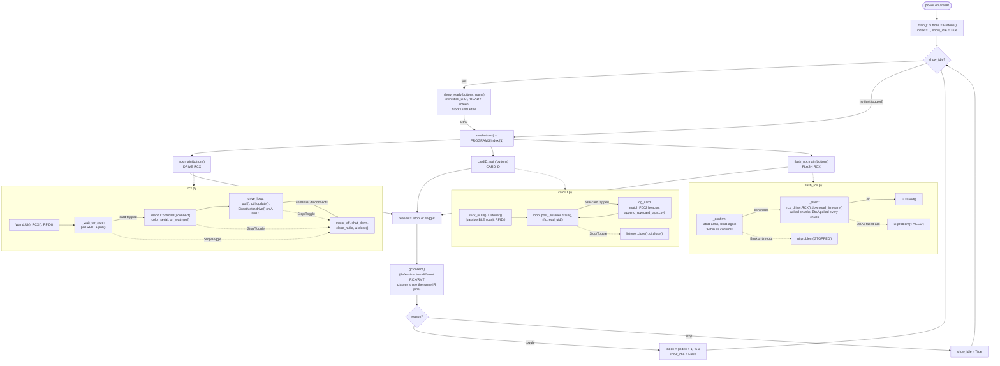

# RCX_Wand

Tap a LEGO Education connection card on an M5Stack StickS3 and pick,
by cycling with a button, from three things it can do: drive a real
LEGO Mindstorms **RCX**'s motors over IR from a Controller brick's
joysticks, log which cards belong to which BLE broadcast, or flash
real RCX firmware over the same IR link.

## Layout

| Path | What it is |
|---|---|
| [`main.py`](main.py) | The menu. Installed as `main.py` on the board so it runs on boot — see the flow chart below. |
| [`rcx.py`](rcx.py) | **DRIVE RCX** — tap a card, find the Controller tapped with it over BLE, drive RCX motors A/C in direct mode. |
| [`cardID.py`](cardID.py) | **CARD ID** — tap cards, log each one's RFID UID against its BLE (FD02) broadcast to `card_taps.csv`. |
| [`flash_rcx.py`](flash_rcx.py) | **FLASH RCX** — flash real RCX firmware over IR, two-tap confirm required first. |
| [`stick_menu.py`](stick_menu.py) | Shared `Stop`/`Toggle` exceptions + button-edge watcher all three programs use to hand control back to the menu. |
| [`m5/`](m5/) | Minimal copy of the M5StickS3 MicroPython hardware library (power, RFID, display, audio, buttons, raw IR, the LEGO BLE "wand" protocol). Sourced from `micropython/M5StickS3/m5/`. |
| [`stick_ui.py`](stick_ui.py), [`lego_card.py`](lego_card.py) | Screen/speaker wrapper and card-decode helpers shared by `cardID.py` (and other example scripts already on the board). |
| [`rcx_ir.py`](rcx_ir.py) | RCX-over-IR driver used by `rcx.py`. Ported from `micropython/M5StickS3/rcx_ir.py`'s framing/encoding, with direct-mode motor control added and corrected (see below). |
| [`rcx_driver.py`](rcx_driver.py) | RCX-over-IR driver used by `flash_rcx.py` and `run_lasm.py` — a separate port from `ESP32-RCX/library/rcx_driver.py`, kept because it already implements the acked firmware/program-download block-transfer protocol `rcx_ir.py` doesn't. |
| [`rcx_firmware_data.py`](rcx_firmware_data.py) | A real RCX firmware image (23,904 bytes), baked in by `ESP32-RCX/tools/srec_to_micropython.py` from a LEGO/ROBOLAB `FIRMWARE.TXT`. What `flash_rcx.py` sends. |
| [`lasm_compiler.py`](lasm_compiler.py), [`CLAUDE.md`](CLAUDE.md) | Host-side LASM (LEGO Assembler) → RCX-bytecode compiler, and the narrative of how its encoding was verified. Needs plain CPython (`dataclasses`, `pathlib`) — doesn't run on the Stick. |
| [`examples/`](examples/) | Five `.lasm` example programs, simplest to most capable — see [`examples/README.md`](examples/README.md). |
| [`tools/build_examples.py`](tools/build_examples.py) | Compiles `examples/*.lasm` (via `lasm_compiler.py`, on the Mac) into `lasm_programs.py`. |
| [`lasm_programs.py`](lasm_programs.py) | Generated by the tool above — MicroPython-ready compiled output, deployed to the board. |
| [`run_lasm.py`](run_lasm.py) | Device-side runner: sends a compiled `lasm_programs.py` entry to the RCX (acked, via `rcx_driver.py`) and starts it. Not wired into the menu — run manually from a REPL. |
| [`lasm-opcode-reference.md`](lasm-opcode-reference.md), [`OpCodes.json`](OpCodes.json) | The RCX/LASM opcode reference used to get motor control and the LASM compiler right. |
| `venv/`, `requirements.txt` | Host-side Python env with the `legoeducation` PyPI package — a reference for the LEGO Education BLE protocol's App color codes (`PURPLE = 6`, etc.), the same numbering `m5/m5_wand.py` uses. Not imported by the on-device code. |

## `main.py`'s flow



Dashed arrows are the `stick_menu.Stop`/`Toggle` exception path — every
program polls buttons on its own schedule (once per RFID poll, once
per drive-loop tick, once per firmware chunk, …) and raises one of
these to hand control back to `main.py`, which is what turns "BtnA
pressed inside `rcx.py`'s drive loop" into "back at the READY screen."
`flash_rcx.py` is the one exception: it never raises `Toggle` (BtnB
means "arm/confirm" there, not "switch program" — see its own
docstring), so it always returns `'stop'`.

## Why `rcx_ir.py` isn't a straight copy

Neither `micropython/M5StickS3/rcx_ir.py` nor the sibling `ESP32-RCX`
project's `library/rcx_driver.py` correctly drives motor direction:

- **`ESP32-RCX/library/rcx_driver.py`**'s `motor_on(motor_id,
  direction=1)` sends opcode `0x21` with flag `0x40` for reverse — but
  `0x21` ("OnOffFloat") only ever encodes float/off/on in its top two
  bits. It has no direction bit. Sending `0x40` there just turns the
  motor **off**, not reverse.
- **`micropython/M5StickS3/rcx_ir.py`** doesn't implement motor
  on/off/direction at all — only `set_power` at the opcode level
  (unused), ping, tone and battery.

Direction is a genuinely separate direct command, opcode `0xE1`
(`SetFwdSetRwdRewDir`), confirmed against LEGO's own P-Brick
Communication Protocol table (`lasm-opcode-reference.md`, §3). Opcode
`0x13` (`SetPower`) also turned out to take a motor **bitmask**
(`0x01`/`0x02`/`0x04`) plus a power-source byte, not the plain `0/1/2`
index both existing repos use. `rcx_ir.py` here implements all three
opcodes (`0x21` on/off/float, `0xE1` direction, `0x13` power) against
the verified table.

**Confirmed live on hardware**: motor A and motor C both run and
reverse correctly with `rcx_ir.py`'s direction constants as currently
set. `flash_rcx.py`'s firmware download and the LASM examples
(`run_lasm.py`) have not yet been tried against a real RCX — see their
own docstrings for status.

## Running it

1. Flash the StickS3 with MicroPython (Octal-SPIRAM build — see
   `micropython/M5StickS3/m5/CLAUDE.md` for exact links/commands).
2. Copy everything in the table above except `venv/`, `requirements.txt`,
   `examples/`, `tools/`, `lasm_compiler.py` and the `.md`/`.json`
   reference files onto the board — those are Mac-side only. e.g.:
   ```
   mpremote cp -r m5 :
   mpremote cp main.py rcx.py cardID.py flash_rcx.py stick_menu.py \
       stick_ui.py lego_card.py rcx_ir.py rcx_driver.py \
       rcx_firmware_data.py lasm_programs.py run_lasm.py :
   ```
3. Wire up the Grove RFID2 Unit (for the connection card) — the StickS3's
   built-in IR LED/receiver need no extra wiring.
4. Point the StickS3 at the RCX's IR window, a few inches away.
5. Power on/reset. `main.py` boots straight into the **READY** screen
   for whichever program is first. **BtnB** starts it (or, once
   something is running, stops it and starts the *next* one
   immediately — see the flow chart). **BtnA** always stops back to
   the READY screen.
   - **DRIVE RCX**: tap a card, then tap the same card on a powered-on
     LEGO Education Controller. Left stick → motor A, right stick →
     motor C.
   - **CARD ID**: tap cards; each gets logged to `card_taps.csv` if its
     BLE broadcast is heard (tap the sender brick first).
   - **FLASH RCX**: BtnB once to arm, BtnB again within 4s to actually
     send. Not destructive if interrupted — see `flash_rcx.py`'s
     docstring.

## LASM examples

`examples/*.lasm` are real downloadable RCX programs (not direct
commands) — see [`examples/README.md`](examples/README.md) for the
progression and how to build/run them via `run_lasm.py`. Not wired
into the menu; run from a REPL.

## Host-side venv

```
python3 -m venv venv
./venv/bin/pip install -r requirements.txt
```

Already done in this checkout. It's there for cross-checking the App
color codes / protocol constants against LEGO's own `legoeducation`
package if you're extending `m5/m5_wand.py`, and for running
`lasm_compiler.py`/`tools/build_examples.py` — nothing on the StickS3
itself runs through this venv.
